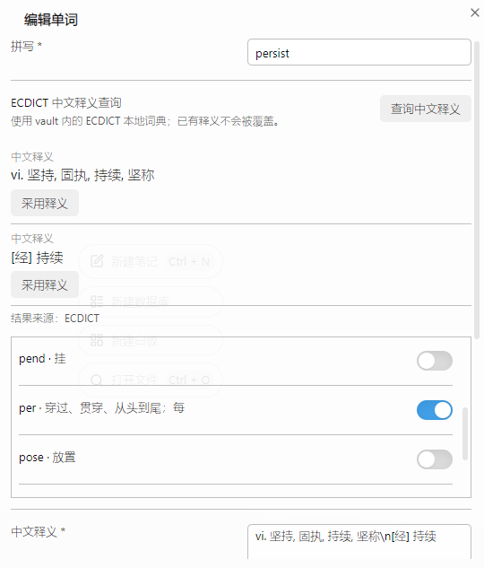
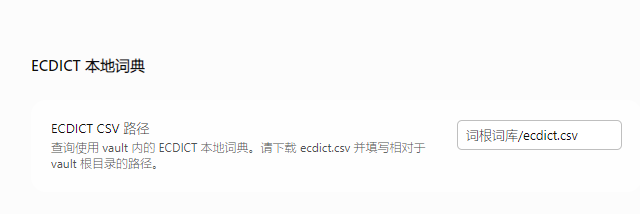

# root-vocabulary

An Obsidian desktop plugin for organizing English roots, affixes, and related vocabulary. It stores every entry as a Markdown note, supports multiple root associations, searches spelling and Chinese meanings, tracks familiarity and favorites, and looks up Chinese definitions from a local ECDICT CSV file.

## Installation and usage

Install the plugin from the Obsidian Community Plugins directory. To install a release manually, copy `main.js`, `manifest.json`, and `styles.css` into `.obsidian/plugins/root-vocabulary/`, then enable `root-vocabulary` in Obsidian.

Open the plugin from the ribbon book icon or the `打开词根词库` command. Create a root or affix before creating related words. Plugin data is stored in `词根词库/词根` and `词根词库/单词`; the Markdown files and their frontmatter remain directly editable.

Chinese meaning lookup uses the local [ECDICT](https://github.com/skywind3000/ECDICT) dataset and does not send words to an online translation service. Download `ecdict.csv`, place it at `词根词库/ecdict.csv`, or configure another vault-relative path in the plugin settings.

## 中文说明

个人英语词根和单词记录插件，适用于 Obsidian 桌面端。数据保存在库内 `词根词库/词根` 和 `词根词库/单词` 的 Markdown 笔记中，可直接修改 头部元数据 和正文。一个单词可以关联多个词根；收藏和熟悉度用于筛选，不安排复习日期。

## 构建与安装

开发与测试使用 Node.js 24 或更新版本。运行 `npm install`、`npm test`、`npm run typecheck`、`npm run build`。

请从 Obsidian 社区插件中搜索` root-vocabulary`安装本插件。 如果手动安装发行版本：将 `main.js`、`manifest.json`、`styles.css` 复制到目录 `.obsidian/plugins/root‑vocabulary/`，之后在 Obsidian 内启用 root‑vocabulary 插件。

点击左侧书本图标打开“打开词根词库”命令。界面分为“词根”和“单词”两个页面，可用顶部标签切换；先新建词根，再新建单词，铅笔图标可重新编辑字段。词根和单词页可按拼写、中文释义、词根形式和变体搜索，并按熟悉度或收藏筛选。单击词根会自动跳转到关联的单词。

## 重点说明

新建单词时，在单词表单点击“查询中文释义”时读取 vault 内的 `ecdict.csv`，不请求网络。请从 [ECDICT 官方仓库](https://github.com/skywind3000/ECDICT) 获取 `ecdict.csv`，或者本仓库获取 `ecdict.csv`，放入 `词根词库/ecdict.csv`。可在插件设置中填写其他相对路径。

